Writeups for bandit challenges ([link for the challenges](https://overthewire.org/wargames/bandit/))


The goal of these is to practice writeups, so that later I can recall my thought process.

[Bandit 0](https://github.com/0xdcnx/ctf_writeups/edit/main/overthewire/bandit#bandit-0)<br>
[Bandit 0-1](https://github.com/0xdcnx/ctf_writeups/edit/main/overthewire/bandit#bandit-0-1)<br>
[Bandit 1-2](https://github.com/0xdcnx/ctf_writeups/edit/main/overthewire/bandit#bandit-1-2)<br>
[Bandit 2-3](https://github.com/0xdcnx/ctf_writeups/edit/main/overthewire/bandit#bandit-2-3)<br>
[Bandit 3-4](https://github.com/0xdcnx/ctf_writeups/edit/main/overthewire/bandit#bandit-3-4)<br>
[Bandit 4-5](https://github.com/0xdcnx/ctf_writeups/edit/main/overthewire/bandit#bandit-4-5)<br>
[Bandit 5-6](https://github.com/0xdcnx/ctf_writeups/edit/main/overthewire/bandit#bandit-5-6)<br>
[Bandit 6-7](https://github.com/0xdcnx/ctf_writeups/edit/main/overthewire/bandit#bandit-6-7)<br>
[Bandit 7-8](https://github.com/0xdcnx/ctf_writeups/edit/main/overthewire/bandit#bandit-7-8)<br>
[Bandit 8-9](https://github.com/0xdcnx/ctf_writeups/edit/main/overthewire/bandit#bandit-8-9)<br>
[Bandit 9-10](https://github.com/0xdcnx/ctf_writeups/edit/main/overthewire/bandit#bandit-9-10)<br>
[Bandit 10-11](https://github.com/0xdcnx/ctf_writeups/edit/main/overthewire/bandit#bandit-10-11)<br>
[Bandit 11-12](https://github.com/0xdcnx/ctf_writeups/edit/main/overthewire/bandit#bandit-11-12)<br>
[Bandit 12-13](https://github.com/0xdcnx/ctf_writeups/edit/main/overthewire/bandit#bandit-12-13)<br>
[Bandit 13-14](https://github.com/0xdcnx/ctf_writeups/edit/main/overthewire/bandit#bandit-13-14)<br>
[Bandit 14-15](https://github.com/0xdcnx/ctf_writeups/edit/main/overthewire/bandit#bandit-14-15)<br>
[Bandit 15-16](https://github.com/0xdcnx/ctf_writeups/edit/main/overthewire/bandit#bandit-15-16)<br>
[Bandit 16-17](https://github.com/0xdcnx/ctf_writeups/edit/main/overthewire/bandit#bandit-0-1)<br>
[Bandit 17-18](https://github.com/0xdcnx/ctf_writeups/edit/main/overthewire/bandit#bandit-0-1)<br>
[Bandit 18-19](https://github.com/0xdcnx/ctf_writeups/edit/main/overthewire/bandit#bandit-0-1)<br>
[Bandit 19-20](https://github.com/0xdcnx/ctf_writeups/edit/main/overthewire/bandit#bandit-0-1)<br>

# Bandit 0:
**ssh to host bandit.labs.overthewire.org with user bandit0 at port 2220**
ssh bandit0@bandit.labs.overthewire.org -p 2220
password: bandit0

# Bandit 0-1
ssh bandit0@bandit.labs.overthewire.org -p 2220

**Description**<br>
The password for the next level is stored in a file called readme located in the home directory. Use this password to log into bandit1 using SSH. Whenever you find a password for a level, use SSH (on port 2220) to log into that level and continue the game.

**Solution**<br>
`cat readme` after logging in. 

**Level 1 password:** NH2SXQwcBdpmTEzi3bvBHMM9H66vVXjL


# Bandit 1-2
ssh bandit1@bandit.labs.overthewire.org -p 2220

**Description**<br>
The password for the next level is stored in a file called - located in the home directory

**Solution**<br>
`cat ./-`

**Level 2 password:** rRGizSaX8Mk1RTb1CNQoXTcYZWU6lgzi


# Bandit 2-3
ssh bandit2@bandit.labs.overthewire.org -p 2220

**Description**<br>
The password for the next level is stored in a file called spaces in this filename located in the home directory

**Solution**<br>
`cat spaces\ in\ this\ filename`

**Level 3 pass:** aBZ0W5EmUfAf7kHTQeOwd8bauFJ2lAiG


# Bandit 3-4
ssh bandit3@bandit.labs.overthewire.org -p 2220

**Description**<br>
The password for the next level is stored in a hidden file in the inhere directory.

**Solution**<br>
`cat inhere/.hidden`

**Level 4 pass:** 2EW7BBsr6aMMoJ2HjW067dm8EgX26xNe


# Bandit 4-5
ssh bandit4@bandit.labs.overthewire.org -p 2220

**Description**<br>
The password for the next level is stored in the only human-readable file in the inhere directory. Tip: if your terminal is messed up, try the “reset” command.

**Solution**<br>
Execute `file` command on each file found with `find` command.
`find . | file -f - `
`cat ./-file07 #print pass`
**Level 5 pass:** lrIWWI6bB37kxfiCQZqUdOIYfr6eEeqR


# Bandit 5-6
ssh bandit5@bandit.labs.overthewire.org -p 2220

**Description**<br>
The password for the next level is stored in a file somewhere under the inhere directory and has all of the following properties:

    human-readable
    1033 bytes in size
    not executable

**Solution**<br>
`find . -size 1033c| file -f -`<br>
`cat ./inhere/maybehere07/.file2`

**Level 6 pass:** P4L4vucdmLnm8I7Vl7jG1ApGSfjYKqJU


# Bandit 6-7
ssh bandit6@bandit.labs.overthewire.org -p 2220

**Description**<br>
The password for the next level is stored in a file somewhere under the inhere directory and has all of the following properties:

    owned by user bandit7
    owned by group bandit6
    33 bytes in size


**Solution**<br>
`find / -size 33c -user bandit7 -group bandit6 | file -f - | grep -v "Permission denied"`
`cat /var/lib/dpkg/info/bandit7.password`

**Level 7 pass:** z7WtoNQU2XfjmMtWA8u5rN4vzqu4v99S


# Bandit 7-8 
ssh bandit7@bandit.labs.overthewire.org -p 2220


**Description**<br>
The password for the next level is stored in the file data.txt next to the word millionth

**Solution**<br>
`cat data.txt | grep -w "millionth"`

**Level 8 pass:** TESKZC0XvTetK0S9xNwm25STk5iWrBvP


# Bandit 8-9 
ssh bandit8@bandit.labs.overthewire.org -p 2220

**Description**<br>
The password for the next level is stored in the file data.txt and is the only line of text that occurs only once

**Solution**<br>
`sort data.txt | uniq -u `

**Level 9 pass:** EN632PlfYiZbn3PhVK3XOGSlNInNE00t


# Bandit 9-10 
ssh bandit9@bandit.labs.overthewire.org -p 2220

**Description**<br>
The password for the next level is stored in the file data.txt in one of the few human-readable strings, preceded by several ‘=’ characters.

**Solution**<br>
`strings data.txt | grep "===="`

**Level 10 pass:** G7w8LIi6J3kTb8A7j9LgrywtEUlyyp6s

 
# Bandit 10-11
ssh bandit10@bandit.labs.overthewire.org -p 2220


**Description**<br>
The password for the next level is stored in the file data.txt, which contains base64 encoded data
**Solution**<br>
`cat data.txt | base64 -d`

**Level 11 pass:** 6zPeziLdR2RKNdNYFNb6nVCKzphlXHBM


# Bandit 11-12
ssh bandit11@bandit.labs.overthewire.org -p 2220

**Description**<br>
The password for the next level is stored in the file data.txt, where all lowercase (a-z) and uppercase (A-Z) letters have been rotated by 13 positions

**Solution**<br>
`tr n-za-mN-ZA-M a-zA-Z < data.txt`

**Level 12 pass:** JVNBBFSmZwKKOP0XbFXOoW8chDz5yVRv


# Bandit 12-13
ssh bandit12@bandit.labs.overthewire.org -p 2220

**Description**<br>
The password for the next level is stored in the file data.txt, which is a hexdump of a file that has been repeatedly compressed. For this level it may be useful to create a directory under /tmp in which you can work using mkdir. For example: mkdir /tmp/myname123. Then copy the datafile using cp, and rename it using mv (read the manpages!)

**Solution**<br>

First, we make a temp folder and copy the data.txt file to out new temp folder. I like using mktemp -t instead. After that we change to our temp folder:
```
mktemp -d
cp data.txt /tmp/tmp.G3HoQxcjLc 
cd /tmp/tmp.G3HoQxcjLc
```

When I use `file data`:``
<br>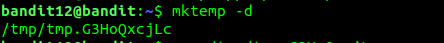

It's recognized as a normal text file, but when you print it's contents we can see that the data is not in 'readable' text. 
<br>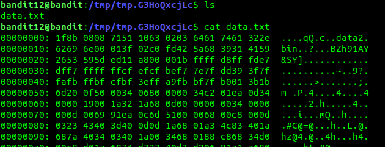

The information provided tells us that the file is in fact the hexdump of a another file which was compressed multiple times.
So first, we need to return the hexdumped data to it's original format.

xxd is a tool that allows us to make a hexdump or do the reverse.. We can use xxd to reverse the hexdump to it's original format, and store the result in a file I'll name "data", with:
`xxd -r data.txt > data`

With command `file data`:
<br>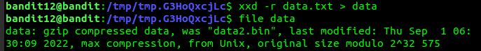

We can see that the file is in fact gzip compressed data. We can use gunzip or gzip -d to decompress the file, but they only allow gzip extensions. So first we rename the file and then we decompress it:
<br>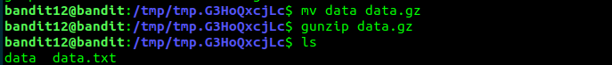

Checking the decompressed file type, it shows that it is a bzip2 compressed file:
<br>

Decompressing and seeing what type of file it is:
<br>

Again we get a bzip file. The process is the same as before:
<br>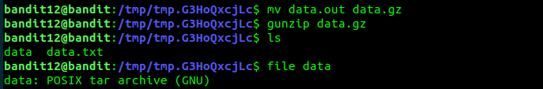

This time the resulting file data5 compressed with tar. Decompressing it we get data5.bin:
<br>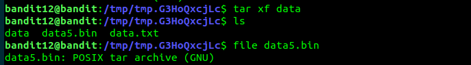

So we repeat the process:
<br>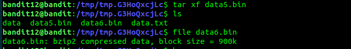

The reslting file data6.bin is compressed using bzip2. We decompress it the same way as before:
<br>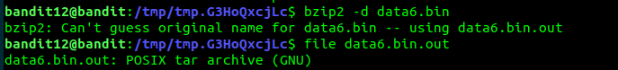

The resulting file data6.bin.out is yet another tar archive:
<br>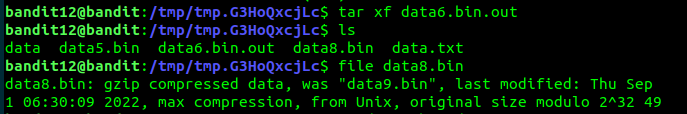

Now the resulting file data8.bin is compressed with gzip. Again, rename it and decompress:
<br>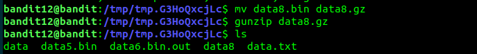
<br>

Finally, the resulting file data8 is an ASCII file:
<br>

With `cat data8`, we finally have have the password for the next level:
<br>

**Level 13 pass:** wbWdlBxEir4CaE8LaPhauuOo6pwRmrDw


# Bandit 13-14
ssh bandit13@bandit.labs.overthewire.org -p 2220

**Description**<br>
The password for the next level is stored in /etc/bandit_pass/bandit14 and can only be read by user bandit14. For this level, you don’t get the next password, but you get a private SSH key that can be used to log into the next level. Note: localhost is a hostname that refers to the machine you are working on

**Solution**<br>
We can use ssh with the -i flag to specify the identity file (private SSH key) and connect to user **bandit14** and host **localhost**.
`ssh -i sshkey.private bandit14@localhost -p 2220`
After connecting to user **bandit14**, we can view the password for the next level.
`cat /etc/bandit_pass/bandit14`

**Level 14 pass:** fGrHPx402xGC7U7rXKDaxiWFTOiF0ENq


# Bandit 14-15
ssh bandit14@bandit.labs.overthewire.org -p 2220

**Description**<br>
The password for the next level can be retrieved by submitting the password of the current level to port 30000 on localhost.

**Solution**<br>
Here I use `nc` to estabilish a connection to localhost with the specified port.
We can use cat to print the contents of the password file `/etc/bandit_pass/bandit14` and pipe it to `nc`.
`cat /etc/bandit_pass/bandit14 | nc localhost 30000`
<br>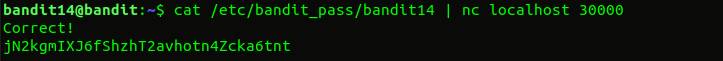

**Level 15 pass:** jN2kgmIXJ6fShzhT2avhotn4Zcka6tnt


# Bandit 15-16
ssh bandit15@bandit.labs.overthewire.org -p 2220

**Description**<br>
The password for the next level can be retrieved by submitting the password of the current level to port 30001 on localhost using SSL encryption.

Helpful note: Getting “HEARTBEATING” and “Read R BLOCK”? Use -ign_eof and read the “CONNECTED COMMANDS” section in the manpage. Next to ‘R’ and ‘Q’, the ‘B’ command also works in this version of that command…

**Solution**<br>
We can use the `openssl s_client [options] host:port` command to estabilish a connection to a server using SSL encryption.  
`echo "jN2kgmIXJ6fShzhT2avhotn4Zcka6tnt" | openssl s_client -connect localhost:30001 -ign_eof 
`
The `-ign_eof` options keeps the connection open to read the response.
<br>

**Level 16 pass:** JQttfApK4SeyHwDlI9SXGR50qclOAil1


# Bandit 16-17
ssh bandit16@bandit.labs.overthewire.org -p 2220

**Description**<br>
The credentials for the next level can be retrieved by submitting the password of the current level to a port on localhost in the range 31000 to 32000. First find out which of these ports have a server listening on them. Then find out which of those speak SSL and which don’t. There is only 1 server that will give the next credentials, the others will simply send back to you whatever you send to it.

**Solution**<br>
I started by creating a temp directory `/tmp/my_temp_dir` to work with
Then I ran `nmap localhost -p31000-32000 --script ssl-cert` to find out which ports are open and which of those ones speak SSL.
<br>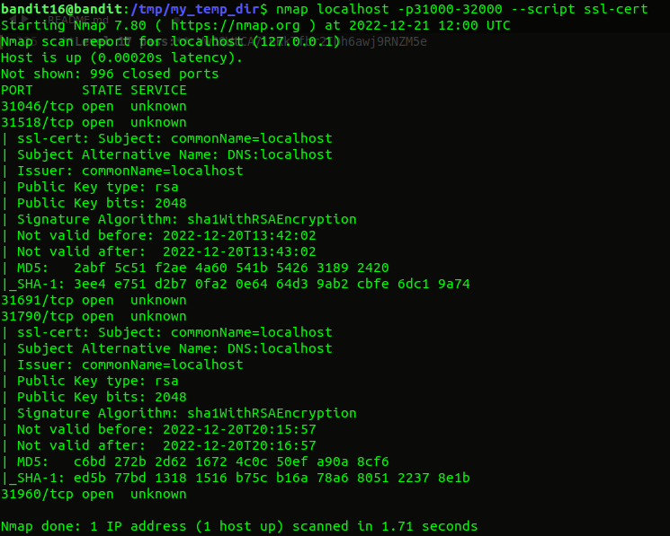

Here we specify `localhost` as the target host since we want to scan our own ports.<br>
With `-p31000-32000` we are specifying the range of ports to be scanned (31000-32000).<br>
`--script ssl-cert` runs a script that detects which of the ports support SSL.

From the output, we can verify that of the 5 open ports, only two support SSL. `31518 and 31790.` 

Just like in the last challenge, we can use echo and pipe the output with `openssl s_client [options] host:port` to send data to the server. But since here we have 2 ports, I created a small bash script that automates the process of sending data to both ports (Also, at first I tought I migh have to run openssl on all 5 ports).
`send_data.sh`

```
#!/usr/bin/bash
ports=(31518 31790)

for port in ${ports[@]}; do
  echo "Running in port $port"
  cat /etc/bandit_pass/bandit16 | timeout 1 openssl s_client -connect localhost:$port -ign_eof -quiet'
done

```
**What the code does:**<br>
First, `cat /etc/bandit_pass/bandit16` prints the contents of the current level.

Next, the command `timeout 1 <command>` is used to force a 1 second timeout to the command `openssl s_client` command. Simply running the `openssl s_client` command causes the shell to hang without being able to move to the next iteration. Either that or openssl has a builtin timeout that takes too long for what I need, so the `timeout` command is still welcome.

`openssl s_client -connect localhost:$port -ign_eof -quiet` command works just like in the previous level but with a few changes:
`-quiet` forces the output to be less verbose.

Running the file I get:
<br>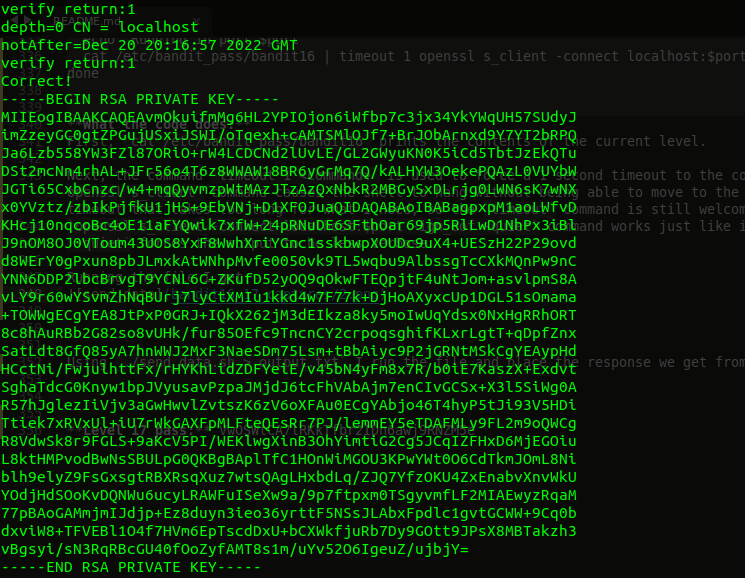

This time instead of the password, we get the rsa private key.  
Using `./send_data.sh > response.txt` I run the file and place the response we get from the server in the file `response.txt`.  

After correctly formating the key, I first run `chmod 700 response.txt ` to change the file permissions as otherwise ssh complains about file permissions. 
<br>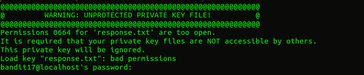

Now I run `ssh -i response.txt bandit17@localhost -p 2220` as user `bandit16` to connect to the server `localhost` as user `bandit17`.
<br>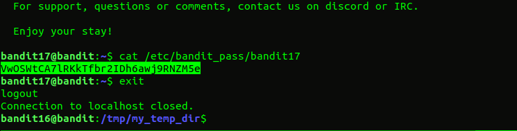

Using `cat /etc/bandit_pass/bandit17` we get the password for the next level.

**Level 17 pass:** VwOSWtCA7lRKkTfbr2IDh6awj9RNZM5e


# Bandit 17-18
ssh bandit17@bandit.labs.overthewire.org -p 2220

**Description**<br>
There are 2 files in the homedirectory: passwords.old and passwords.new. The password for the next level is in passwords.new and is the only line that has been changed between passwords.old and passwords.new

NOTE: if you have solved this level and see ‘Byebye!’ when trying to log into bandit18, this is related to the next level, bandit19

**Solution**<br>
diff command allows us to compare files.<br>
`diff passwords.old passwords.new`

**Level 18 pass:** hga5tuuCLF6fFzUpnagiMN8ssu9LFrdg

# Bandit 18-19
ssh bandit18@bandit.labs.overthewire.org -p 2220

**Description**<br>
The password for the next level is stored in a file readme in the homedirectory. Unfortunately, someone has modified .bashrc to log you out when you log in with SSH.

**Solution**<br>
As explained in the description, we're logged out when we connect with ssh. The idea here is to find a way to login without sourcing the .bashrc file. A number of ways are available to achieve this.
One such way is to mash press Ctrl+c as soon as we log in, but the issue with this solution is making it work consistently.

What I used:<br>
`ssh -t bandit18@bandit.labs.overthewire.org -p 2220 /bin/bash --norc`<br>
The `-t` option forces a pseudo-terminal allocation.<br>
`/bin/bash --norc` starts bash without sourcing the `~/.bashrc`.

**Level 19 pass:** awhqfNnAbc1naukrpqDYcF95h7HoMTrC


# Bandit 19-20
ssh bandit19@bandit.labs.overthewire.org -p 2220

**Description**<br>
To gain access to the next level, you should use the setuid binary in the homedirectory. Execute it without arguments to find out how to use it. The password for this level can be found in the usual place (/etc/bandit_pass), after you have used the setuid binary.

**Solution**<br>
Here we only need to run cat on the password for the next level. Since the suid binary anllows us to run commands as user bandit20, all we need to do is:
`./bandit20-do cat /etc/bandit_pass/bandit20`

**Level 20 pass:** VxCazJaVykI6W36BkBU0mJTCM8rR95XT


# Bandit 20-21
ssh bandit20@bandit.labs.overthewire.org -p 2220

**Description**<br>
There is a setuid binary in the homedirectory that does the following: it makes a connection to localhost on the port you specify as a commandline argument. It then reads a line of text from the connection and compares it to the password in the previous level (bandit20). If the password is correct, it will transmit the password for the next level (bandit21).

NOTE: Try connecting to your own network daemon to see if it works as you think

**Solution**<br>
<!-- When we run the setuid binary, it makes a connection to localhost on a specified port (Ex: 9999),  -->
We need two terminals to solve this challenge:
1st terminal to use the setuid on a specified port (ex: 9999). After connecting it expects to read the current level password from the connection.

The 2nd terminal is used to send the current level password on a specified port and wait for a connection.

`Tmux` is a terminal multiplexer, which means it enables us to use multiple terminals in a single window, exactly what we need to achieve our goal.

After spliting the terminal into two panes, we can:<br>
In the 1st one, `cat /etc/bandit_pass/bandit20 | nc -lv 9999`<br>
Here we first use `cat /etc/bandit_pass/bandit20` to print the current level password, and then we pipe the output to `nc -lv 9999` which listens for a connetion on port 9999.
<br>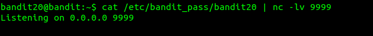

In the second terminal/pane:<br>
`./suconnect 9999` which connects to localhost (as explained in the description) on port 9999.

Since we already set up the 1st terminal/pane to send the correct password for the current level, we get:
<br>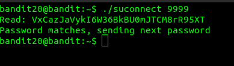

Back in our 1st terminal/pane a response is received:
<br>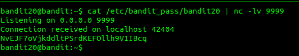

**Level 21 pass:** NvEJF7oVjkddltPSrdKEFOllh9V1IBcq

