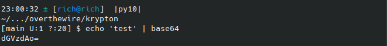
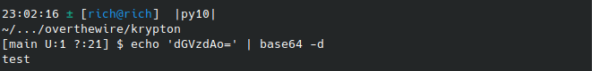
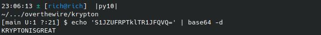

# Writeups for krypton challenges

Krypton ([official wargame page](https://overthewire.org/wargames/krypton/)) is a series of challenges from [overthewire.org](https://overthewire.org/wargames) that focus on teaching concepts about cryptography.

**SSH info:** 
Host: *krypton.labs.overthewire.org* 
Port: *2231*

# krypton 0-1 

**Level Info**

Welcome to Krypton! The first level is easy. The following string encodes the password using Base64:

S1JZUFRPTklTR1JFQVQ=

Use this password to log in to krypton.labs.overthewire.org with username krypton1 using SSH on port 2231. You can find the files for other levels in /krypton/

**Solution**

We can ssh into the machine with: 
`ssh krypton1@krypton.labs.overthewire.org -p 2231`.

The information provided tells us that the password to access the first level was encoded using Base64, which we can learn more about [here](https://en.wikipedia.org/wiki/Base64).

A big hint to tell when something might be encoded with base64 is when the encoded string contains a combination of uppercase/lowercase letters and numbers. A single or double character `=` at the ending (which is used for padding) is also a big indication.

We can use the command line tool `base64` to both encode and decode an encoded string.

As an example, if we wanted to encode the string `test` in base64, we could issue the commmand:

`echo 'test' | base64`

To reverse the process we run `base64` with the flag -d:

We can use the same command with the string we were given to get the password:

Success! We have the password for the next level.

**krypton 2 password:** KRYPTONISGREAT

