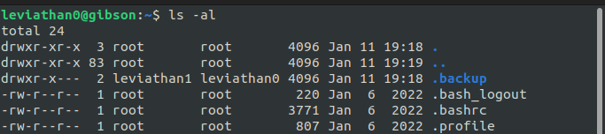
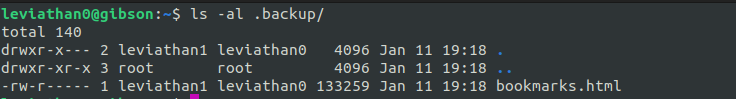
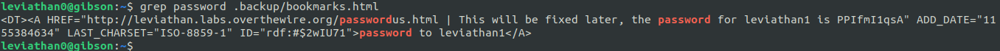
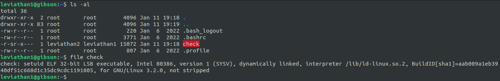
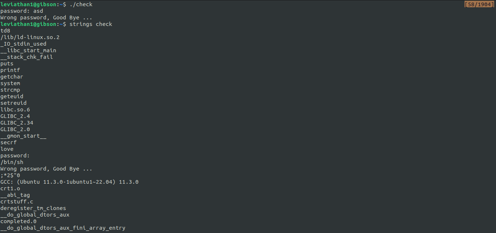
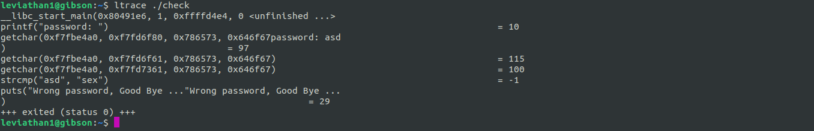
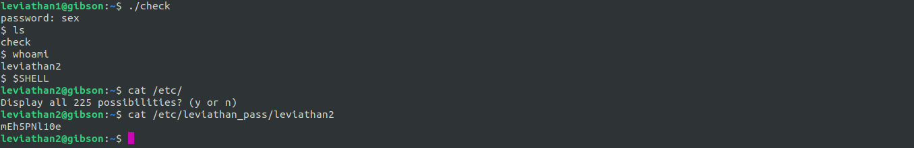

Writeups for leviathan challenges

**Summary** 
Difficulty: 1/10 
Levels: 8 
Platform: Linux/x86 

Author: 
Anders Tonfeldt

# Solved challenges
1. [Leviathan 0 -> 1](https://github.com/ricardo-uqueio/ctf_writeups/tree/main/overthewire/leviathan#leviathan-0-1)
2. [Leviathan 1 -> 2](https://github.com/ricardo-uqueio/ctf_writeups/tree/main/overthewire/leviathan#leviathan-1-2)
3. [Leviathan 2 -> 3](https://github.com/ricardo-uqueio/ctf_writeups/tree/main/overthewire/leviathan/leviathan2_3#readme)
4. [Leviathan 3 -> 4](https://github.com/ricardo-uqueio/ctf_writeups/tree/main/overthewire/leviathan/leviathan3_4#readme)

# Leviathan 0-1

This is a series of beginner challenges geared towards basic *nix commands. 

`ssh leviathan0@leviathan.labs.overthewire.org -p 2223`

**username:** leviathan0 
**password:** leviathan0

# Solution
After logging in, I checked the files in the home directory, as the description mentions that data for the levels can be found in the home directory:

There is a hidden `.backup` directory. Taking a look at it's contents:

There's an html file...

Success!

**Password for leviathan1:** PPIfmI1qsA

# Leviathan 1-2

`ssh leviathan1@leviathan.labs.overthewire.org -p 2223`

# Solution
First, we check what we have in the home directory:

We are given the file `check` which is a setuid executable. Without going into much details, this means that we can execute the file.

Running the file, it asks for a password and waits for input:

There's a couple of ways to solve this challenge. First I tried using `strings` command, which prints all printable characters in the file. This is to check if possibly the password is lying in plain sight. The string 'love' pops out but when I try it as the password, it doesn't work.

The next step would be to use ltrace or strace to see if either helps.

From running ltrace, it seems that the program tries to compare our input with the string 'sex'.

Success! Using that string as the password gives a shell. Checking who is the current user reveals that we've upgraded to 'leviathan2', we can print the password to connect to this level with ssh as we have read access to the password file:

I used the command `$SHELL` to spawn a nicer terminal as the one given is very limited.

**Password for leviathan2:** mEh5PNl10e

[Next level: Leviathan 2 -> 3](https://github.com/ricardo-uqueio/ctf_writeups/tree/main/overthewire/leviathan/leviathan2_3#readme)

[Back to the list of solved challenges](https://github.com/ricardo-uqueio/ctf_writeups/tree/main/overthewire/leviathan#solved-challenges)

