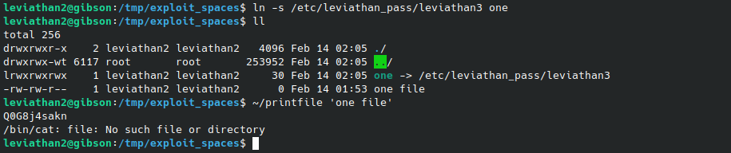

# Leviathan 2-3
`ssh leviathan2@leviathan.labs.overthewire.org -p 2223`

**Solution** 
Solving this level involves using a very interesting trick (or rather 2 tricks). First, we take a look at the available files in the home directory with `ls -al` or it's shorthand equivalent `ll` (if available as an alias). There is a `printfile` setuid executable.

Trying to run the file tells us what it does and how to use it. It prints the contents of a file, but when we try to print the password for the next level, it does not allow us.

Just like in the previous level, let's run ltrace on the file to see what pops up:

Let's run ltrace again but this time specifying the password file for the current level which we do have permissions to read, so we can see what happens:

The file is using the `access()` method to verify that we have the right permissions before accessing the file being passed in.
After `access()` checks that we do in fact have permissions to read the file we input, it then runs `/bin/cat %s` where %s is what we input, in this case the password file for leviathan2. 

**Method 1** 
The issue here is that `access()` uses the full pathname for the file we provide to check for permissions, but when executing `/bin/cat %s`, the **%s** is not sanitized to make sure that what we input is really just a file name. We can take advantage of this by using a semicolon (`;`) in the filename which when passed to `%s`, allows us to execute another command after `/bin/cat`. We can verify this behavior by using `;id` in the filename and use ltrace on it:

From the output we can see that first, `access()` checks to see if we have permissions to read the file `exploit;id`. Since we do, the program then tries to run `/bin/cat %s` with %s being the file we created. Because the file contains a semicolon, it interprets this as two different commands: It first tries to run `/bin/cat exploit` and then tries to run the command `id`.

We can also see that the `id` command prints information about user leviathan3. This is because `printfile` is a setuid binary which temporarily elevates our privileges to that of user leviathan3. This means that after `access()` checks that we have permissions to read a file, the next commands are executed as user leviathan3.

All that is left is to find a way to view the password file for the next level. Instead of using `id` we can use command `sh` to spawn a terminal and run cat to get the password for the next level:

Success!

**Method 2** 
The second method is similar to the first in that it takes advantage of the fact that when the program tries to run `/bin/cat %s`, the %s is not sanitized.

As stated before, when `access()` runs, it uses the full pathname of the file provided to check if we have the right permissions for the file. The command `bin/cat %s` however does not check the full path of the filename provided. We can confirm this behavior by creating a filename with spaces and running ltrace on it:

We can see from the output that when a filename with spaces is provided - "one file" - `access()` is "correctly" interpreting our filename as a single file but `/bin/cat` incorrectly assumes that we are providing two files: "one" and "file" and attempts to run `/bin/cat` on both of them.
<!-- 
But since `access()` is "correctly" interpreting our "one file" as a single file, `/bin/cat` is then executed with the permissions of leviathan3. -->

In summary, the way to exploit this:

1. create a file with spaces on it's name (Ex: 'one file')
2. create a symbolic link to `/etc/leviathan_pass/leviathan3` using 'one'
3. run `./printfile 'one file'`
4. `access()` checks if we have the correct permissions for 'one file', we do
5. program grants us permissions for user leviathan3
6. program tries to run `/bin/cat one` and `/bin/cat file`
7. since `one` is a symlink to /etc/leviathan_pass/leviathan3, it prints it's contents

Success!

**Password for leviathan3:** Q0G8j4sakn

[Next level: Leviathan 3 -> 4](https://github.com/ricardo-uqueio/ctf_writeups/tree/main/overthewire/leviathan/leviathan3_4#readme)

[Back to the list of solved challenges](https://github.com/ricardo-uqueio/ctf_writeups/tree/main/overthewire/leviathan#solved-challenges)

