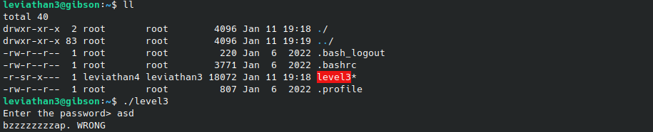
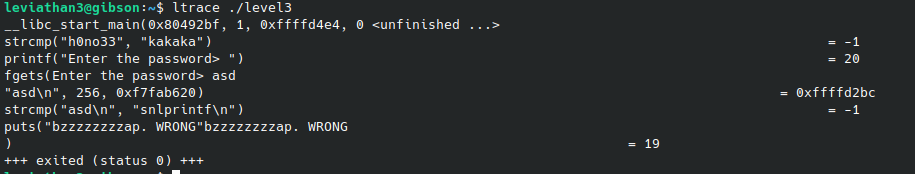
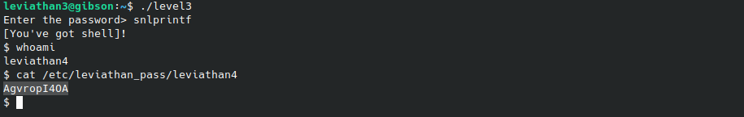

# Leviathan 3-4
`ssh leviathan3@leviathan.labs.overthewirpe.org -p 2223`

**Solution** 
This one is fairly easier than the previous levels if we can understand the output of ltrace.

We're given a file called `level3` which when executed asks for a password and simply exits if it's wrong.

Running ltrace to see a bit of what is going on during execution:

First it uses `strcmp()` to compare two different hardcoded strings. Then it asks for us to input the password and uses `strcmp()` again but this time to compare our input with the hardcoded string 'snlprintf'. 

Running the file again and using this hardcoded string as the password we get a terminal as user leviathan4, which we can use to print the next level's password:

**Password for leviathan4:** AgvropI4OA

[Back to the list of solved challenges](https://github.com/ricardo-uqueio/ctf_writeups/tree/main/overthewire/leviathan#solved-challenges)

