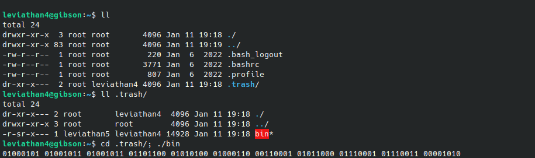
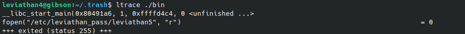
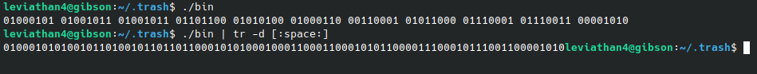
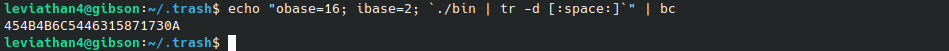
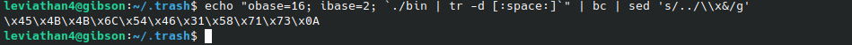
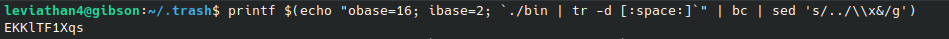
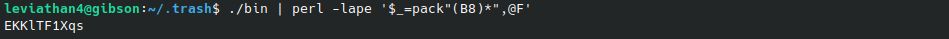

# Leviathan 4-5
`ssh leviathan4@leviathan.labs.overthewire.org -p 2223`


**Solution**<br>
There is a hidden folder which contains a setuid  executable. Executing the file simply prints some binary data.



Just as before, we can use ltrace to see what library calls are being executed by the program:



It seems that the program uses `fopen()` to open the password file for the next level. From this, we can maybe assume that the binary data being printed is the binary representation of the password, so we need to convert it back from binary to ASCII. 

There are tools online that automate this conversion process, but I like using bash (and it looks cool :D )

```
printf $(echo "obase=16; ibase=2; `./bin | tr -d [:space:]`" | bc | sed 's/../\\x&/g')
```


**Explaination**

First we have the `printf $()` but I'll get to that later.

I use `bc` which is a tool that can also convert data from one base to another. To convert from binary to ASCII, command `echo "obase=16; ibase=2; data` is used to specify the output base (base 16 for ASCII characters), the input base (base 2 for binary) and next is the **data** do be converted. This is then piped to `bc`.

To get the **data** in the correct format, I first run the file, pipe the output and use `tr -d` and delete whitespaces from the output we get when running the `bin` file, which is important for the next part of the code. Notice the backticks surrounding the command. This makes it so that the whole command is interpreted as a single variable, the **data** to be converted.

**./bin output without whitespaces:**



**bc converted data:**



Up until now what we have is the ASCII character codes for each character. 

Next we pipe the output to `sed 's/../\\x&/g'` which takes each 2 characters and appends `\x` to them. 

**data with sef formatting:**



This way, when we use `print $()` it converts the character codes into actual string values.




**A shorter way of achieving this from the terminal, using perl:**

`./bin | perl -lape '$_=pack"(B8)*",@F'`



**Password for leviathan5:** EKKlTF1Xqs

[Next level: Leviathan 5 -> 6](https://github.com/ricardo-uqueio/ctf_writeups/tree/main/overthewire/leviathan/leviathan5_6#readme)

[Back to the list of solved challenges](https://github.com/ricardo-uqueio/ctf_writeups/tree/main/overthewire/leviathan#solved-challenges)

