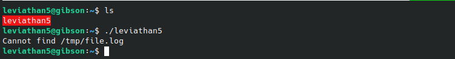
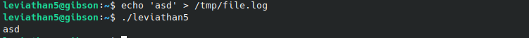
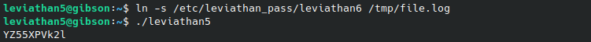

# Leviathan 5-6
`ssh leviathan5@leviathan.labs.overthewire.org -p 2223`

**Solution** 
There is an executable file in the $HOME directory. Running it complains about a missing file:

So I created the file with some content and ran it again:

It seems that our executable simply prints out the contents of `/tmp/file.log`. So How can we exploit this to get the password for the next level? We've already seen a similar approach to the one we can use here in a previous level. 

We can create a symbolic link to the password file, and since the setuid is set to run as user leviathan6, we should have permissions to read the file. 

**Password for leviathan6:** YZ55XPVk2l

[Next level: Leviathan 6 -> 7](https://github.com/ricardo-uqueio/ctf_writeups/tree/main/overthewire/leviathan/leviathan6_7#readme)

[Back to the list of solved challenges](https://github.com/ricardo-uqueio/ctf_writeups/tree/main/overthewire/leviathan#solved-challenges)
