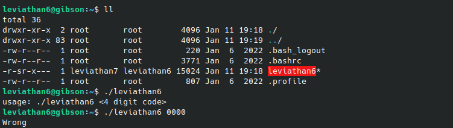

# Leviathan 6-7
`ssh leviathan6@leviathan.labs.overthewire.org -p 2223`

**Solution** 

Trying to run the given file, it requires 4 digits. 

The output from ltrace:

Not very informative at first glance, but `atoi(const char *nptr)` [(atoi docs)](https://man7.org/linux/man-pages/man3/atoi.3.html) converts the string that is pointed to by nptr to int.

We can deduce that the program takes the values pointed to by the addresses passed as parameters in `atoi()` and converts them to int. These integers are then, at some point, compared to the ones we input.

There are at least 2 ways of solving this challenge. The first one (and probably the easiest, from a personal point of view) is to bruteforce the password.

Since it's only 4 digits, we should be able to make a script that tests values between 0000-9999.

<!-- **Warning:** A better approach to using this method, instead of the following one liner, is to create a script. -->

`for i in {0000..9999}; do ./leviathan6 $i; done`

This goes on until the correct value for the pin is tested, and it returns a terminal

The second approach to solving this is to use `gdb`. Since our input is, at some point compared to the correct pin, we should be able to use the debugger to view what our input is being compared to. 

Knowing that the program uses the values obtained from `atoi` before comparing should be a hint to the right direction :)

**Password for leviathan7:** 8GpZ5f8Hze

<!-- [Next level: Leviathan 7 -> 8](https://github.com/ricardo-uqueio/ctf_writeups/tree/main/overthewire/leviathan/leviathan6_7#readme) -->

[Back to the list of solved challenges](https://github.com/ricardo-uqueio/ctf_writeups/tree/main/overthewire/leviathan#solved-challenges)
