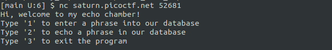
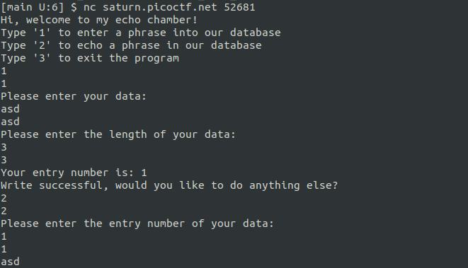
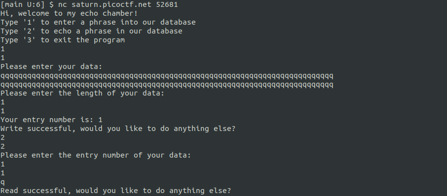
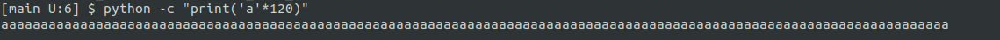
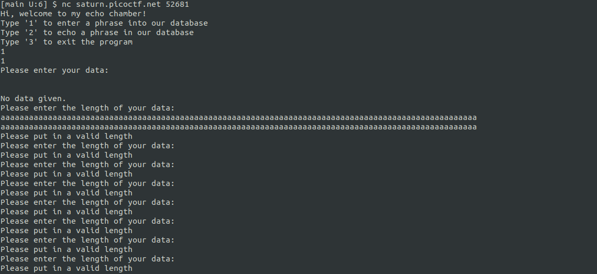
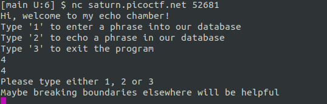
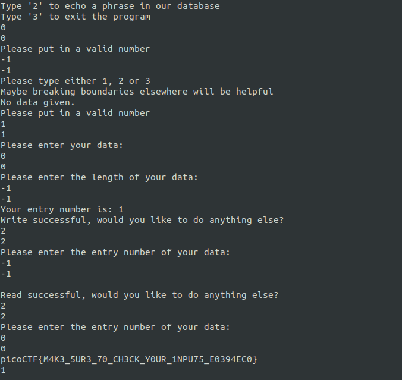

# basic-file-exploit
Author: Will Hong

Category: binary exploitation

Points: 100

# Description
The program provided allows you to write to a file and read what you wrote from it. Try playing around with it and see if you can break it! Connect to the program with netcat: `$ nc saturn.picoctf.net 52681`

# Solution
Taking a look at the `program-redacted.c` file to see where the possible attack vector is, what stood out was the fact that we can both provide an input and define the length of the input...

Running `nc saturn.picoctf.net 52681`, the following menu is presented:



Testing out the program to see how it works, I can provide something as the input and specify the length of the input to be writen on the file. An entry number is then provided that allows to view what I just wrote to the file:



What comes to mind first is to try and write something lenger than the provided data length:



But the program still works 'as expected'.
From the source code, the input's lenght should not be longer than 100.
```
...
printf("Please enter your data:\n");
r = tgetinput(input, 100);
...
```

What if I provide an input that is above the expected number of characters? Like 120 characters:




The program does break, but not in the way expected (no buffer overflow is thrown).

Instead of breaking the code this way, what happens when I select an option the code is not expecting?



This seems like a hint! How about providing more unexpected values in different parts of the program?



Success!

