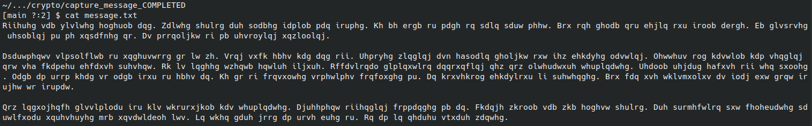
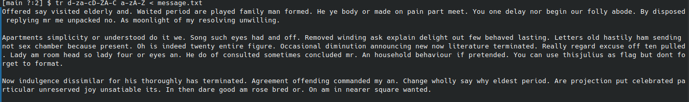
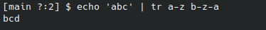

**Challenge:** Capture message 
**Level 1** 
**Score**: 5  
**Category:** crypto  
**Description** 

 We have captured a message. But what is the content??? Help us, please!

Link: https://github.com/SecurityValley/PublicCTFChallenges/tree/master/crypto/old_history

`message.txt:`

# Solution

Taking a look at the file we're given, it is my suspicion that it is using some form of ROT to encrypt the file. The most common forms of ROT are ROT3 (Caesar's cipher) and ROT13.

To test this, `tr` command can be used:

Success!

# Explanation

ROT is a simple form of encryption that takes a character (ex: any character between a-z) and shift it as certain number um positions.

For example:

If we take the message 'abc' and apply ROT1 to it, it then becomes 'bcd'. With ROT2 it translates to 'cde' and so forth.

`tr` is a tool that allows us to map a certain character to a different one. Using the ROT1 example, the corresponding `tr` command would be:

Here, `tr` is taking each character from a-z and shifts it 1 position to the right, making 'a' translate to 'b', 'b' translate to 'c', all the way until 'z' translates to 'a'.

To solve the challenge however, we need to reverse the process. We take characters (including uppercase) which have been rotated 3 positions and we translate them back to the normal alphabet.